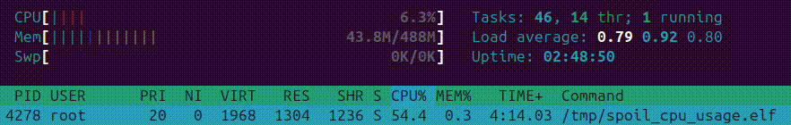

# Spoil CPU Usage

This repository contains a tool used to spoil CPU usage computation
on linux system with RT_PREEMPT patch enabled.



## Build

```bash
cmake -B build
cmake --build build
```

## Problem

There is a good description of the problem available at https://docs.kernel.org/admin-guide/cpu-load.html.
Following this, all tools that measure CPU usage using `/proc/stat` such as `htop` may display incorrect values.

## Solution


The solution is to use cgroups instead.

## References

- https://docs.kernel.org/admin-guide/cpu-load.html
- https://docs.redhat.com/en/documentation/red_hat_enterprise_linux/6/html/resource_management_guide/sec-cpuacct
