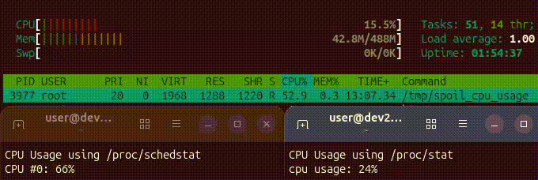
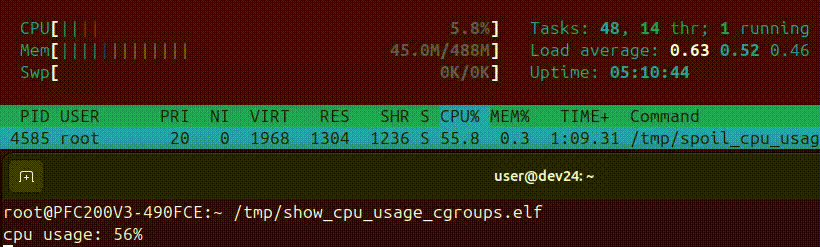

# Spoil CPU Usage

This repository contains a tool used to spoil CPU usage computation
on linux system with RT_PREEMPT patch enabled.



## Build

```bash
cmake -B build
cmake --build build
```

## Problem

There is a good description of the problem available at https://docs.kernel.org/admin-guide/cpu-load.html.
Following this, all tools that measure CPU usage using `/proc/stat` such as `htop` may display incorrect values.

## Other Ideas

### cgroup v1




> [!NOTE]
> cpuacct was removed in cgroup v2

## Notes on /proc/schedstat

In order to enable `/proc/schedstat` the kernel option `CONFIG_SCHEDSTATS=y` must active.

Some docs suggest to also enable scheduler statistics at runtime using the following command:

```bash
sudo sysctl -w kernel.sched_schedstats=1
```

But, as observation shows, this is not necessary to gather basic CPU usage information. The
required field #7 of `/proc/schedstat` is updated even if `kernel.sched_schedstats=0` is
set _(not sure if this is true for all linux system / kernel versions)_.

### Security Considerations

> [!NOTE]
> There is some criticism about `/proc/schedstat` when it is used in security-aware environments.

The source of this criticism are papers about side channel attacs. Some of them are linked below
for reference. Note that those papers use various information exposed by `/proc` filesystem. In
fact, `/proc/schedstat` is only mentioned in very few of them directrly and only as side note.

If security is a need, there is more required than disabling `/proc/schedstat`, e.g. use the
mount option `hidepid=2` when mounting the `/proc` filesystem.

In order to prevent other users than root to see the contents of `/proc/schedstat` a start script
can change the visibility of the file on bootup.

```bash
chmod 0400 /proc/schedstat
```

### Runtime Overhead

There are voices _(not confirmed yet, since there is no clear reference found yet)_ that
`/proc/schedstat` comes with a runtime overhead of 1-2% CPU usage.

This overhead occurs when `kernel.sched_schedstats` is set to 1, which may not be necessary as
stated above.

## References

- https://docs.kernel.org/admin-guide/cpu-load.html
- https://docs.redhat.com/en/documentation/red_hat_enterprise_linux/6/html/resource_management_guide/sec-cpuacct
- https://www.man7.org/linux/man-pages/man7/cgroups.7.html
- https://docs.kernel.org/admin-guide/cgroup-v1/cgroups.html
- https://docs.kernel.org/admin-guide/cgroup-v2.html
- https://www.kernel.org/doc/html/latest/filesystems/proc.html

### /proc/schedstat related

- https://docs.kernel.org/scheduler/sched-stats.html
- https://www.kernel.org/doc/html/v6.2/security/self-protection.html
- https://www.kicksecure.com/wiki/Security-misc
- https://gruss.cc/files/procharvester.pdf
- https://vmonaco.com/papers/SoK-%20Keylogging%20Side%20Channels.pdf
- https://yinqian.org/papers/ccs15.pdf

